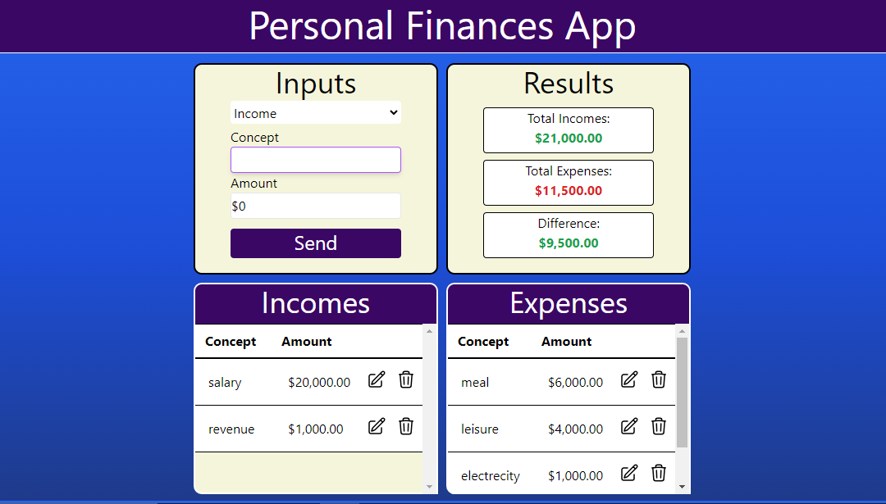

# This is a Personal Finances App, which i made with the Stack MERN (MongoDB, Express, React and Node)
This project consists of a backend, which i made with Express and MongoDB, and a frontend, which i made with React and Tailwind css.

In this app you can enter your incomes and expenses, you can edit and delite this data, and you can see the net balance of your income and expenses in real time.

